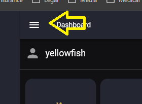
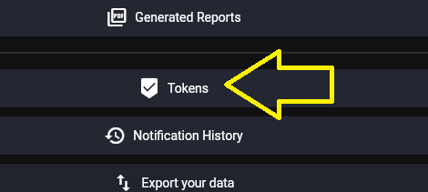
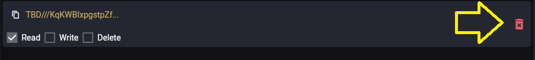
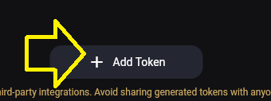
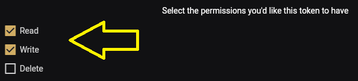
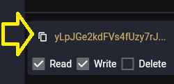

# Create a Simply Plural API Token

PluralBridge uses a Simply Plural/Apparyllis API token only to export user-owned data from Simply Plural.

SP_TOKEN is export-only. It is not a PluralBridge credential.

## Security note

API tokens should be treated like passwords.

Do not post tokens publicly. Do not commit them to Git. Do not place token text in screenshots unless the token text is fully obscured.

For export and preservation workflows, **Read** permission is required.

**Write** permission is optional and should be used only if future tooling needs write operations.

**Delete** permission is not recommended for preservation exports.

## Step 1: Open the main menu

Click the hamburger menu in the upper-left corner.



## Step 2: Open Settings

Click the settings gear.


## Step 3: Open Account

Click Account in the settings panel.


## Step 4: Open Tokens

Click Tokens in the account settings list.



## Step 5: Revoke an existing token when rotating credentials

If you are invalidating an old token or replacing an exposed token, click the delete icon for the existing token. The token text in this screenshot is intentionally blurred.



## Step 6: Add a new token

Click Add Token from the token list area.


## Step 7: Confirm Add Token

Click Add Token again on the token creation control.



## Step 8: Select token permissions

For export/preservation work, Read permission is required. Write should only be selected if future tooling needs write operations. Delete is not recommended for preservation exports.



## Step 9: Copy the new token

Long-press or select the generated token value when you need to copy it. Store it only in a local environment variable such as SP_TOKEN. The token text in this screenshot is intentionally blurred.



## Git Bash environment variable example

In Git Bash, enter the token without displaying it on screen:

```bash
read -s -p "Paste Simply Plural token: " SP_TOKEN
echo
export SP_TOKEN
```

In Git Bash, the `-s` option keeps the token from being displayed while you paste it.

For macOS Terminal / zsh users, use these commands instead:

```sh
printf "Paste Simply Plural token: "
stty -echo
IFS= read -r SP_TOKEN
stty echo
printf "\n"
export SP_TOKEN
```

Run the appropriate block in the same terminal window where you will continue the export guide.

Check that a token value was stored without printing the token itself:

```bash
printf 'Token length: %s\n' "${#SP_TOKEN}"
```

Expected result:

```text
Token length: <number>
```

## Project boundaries

PluralBridge is published by Needs of the Many.

PluralBridge is independent and has no affiliation with Simply Plural, Apparyllis, or the Simply Plural development team.

SP_TOKEN is export-only and used only to export user-owned data from Simply Plural/Apparyllis. It is not a PluralBridge credential.
